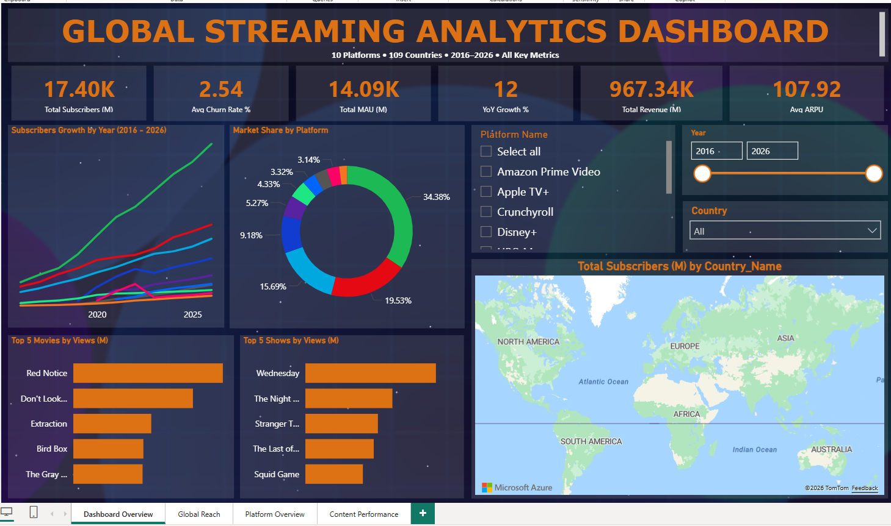
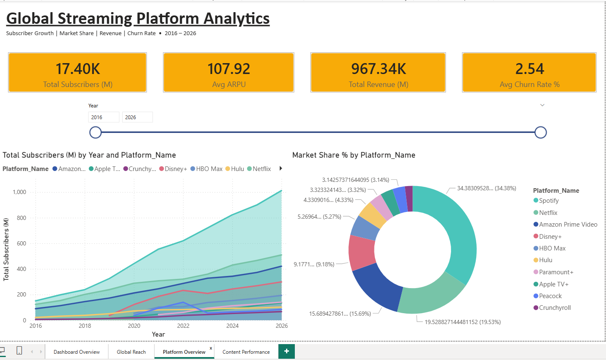
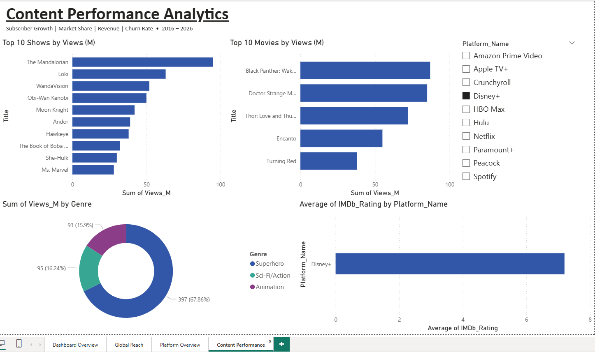
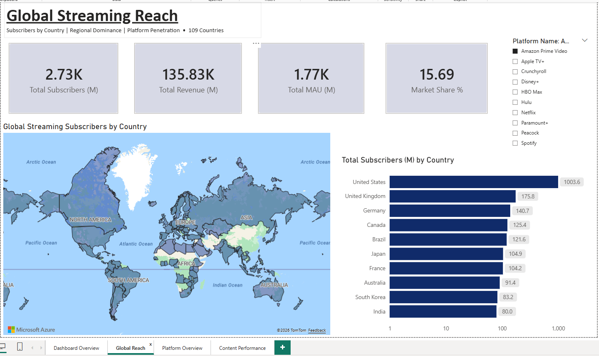

# 🎬 Global Streaming Analytics Dashboard

> A professional 4-tab interactive Power BI dashboard analyzing global 
> streaming platform performance across 10 platforms, 109 countries, 
> and 11 years (2016–2026). Built with realistic simulated data covering 
> subscribers, revenue, churn, MAU, content ratings and geographic reach.

---


---

## 🛠️ Tools & Technologies

| Tool | Usage |
|------|-------|
| **Power BI Desktop** | Dashboard design & visualization |
| **DAX** | 10+ custom measures |
| **Power Query** | Data transformation & ETL |
| **Star Schema** | Data modeling |
| **Excel** | Source data (24,352 rows) |
| **Git & GitHub** | Version control |

---

## 📊 Key Metrics

| Metric | Value |
|--------|-------|
| Platforms | 10 |
| Countries | 109 |
| Time Period | 2016 – 2026 |
| Total Data Rows | 24,352 |
| DAX Measures | 10+ |
| Dashboard Tabs | 4 |
| Content Titles | 121 |

---

## 🖥️ Dashboard Preview

### 1️⃣ Dashboard Overview


> **The executive landing page of the dashboard.** Features 6 KPI cards 
> showing Total Subscribers, Avg Churn Rate, Total MAU, YoY Growth, 
> Total Revenue and Avg ARPU. Includes a stacked area chart showing 
> subscriber growth from 2016–2026 across all 10 platforms, a donut 
> chart for market share breakdown, Top 5 Movies and Top 5 Shows by 
> views, and a world map showing global subscriber distribution. 
> Interactive slicers for Platform, Year and Country allow full 
> cross-filtering across all visuals.

---

### 2️⃣ Platform Overview


> **Deep dive into platform-level performance.** Shows subscriber growth 
> trends per platform over time using an area chart with platform-level 
> color coding. The market share donut chart breaks down each platform's 
> share of total global subscribers. A year range slicer allows dynamic 
> filtering to see how market dominance shifted over time — notably 
> Spotify's consistent lead, Netflix's strong growth, and Disney+'s 
> rapid rise after its 2019 launch.

---

### 3️⃣ Content Performance


> **Analyzes content performance across all 10 platforms.** Features a 
> Top 10 Shows by Views bar chart (Wednesday, Squid Game, Stranger 
> Things leading) and a Top 10 Movies by Views bar chart (Red Notice, 
> Don't Look Up, Extraction leading). A genre breakdown donut chart 
> shows the most popular content categories. An IMDb Rating by Platform 
> bar chart reveals that Apple TV+ and HBO Max produce the highest-rated 
> content despite smaller subscriber bases. Platform slicer allows 
> filtering to see content performance per platform.

---

### 4️⃣ Global Reach


> **Geographic analysis of streaming platform penetration worldwide.** 
> A filled map visual shades all 109 countries by subscriber volume — 
> darker shading indicates higher subscriber concentration. The United 
> States dominates with the highest subscriber count, followed by 
> the UK, Germany, India and Brazil. A Top 10 Countries bar chart 
> provides a ranked view. Platform and Year slicers allow exploration 
> of which platforms lead in specific regions and how geographic 
> reach expanded over the decade.

---


## 🗄️ Data Model

Star schema with 1 fact table and 4 dimension tables:
                Dim_Platforms
                     |
Dim_Date ── Fact_Subscribers ── Dim_Countries
|
Dim_Content

| Table | Rows | Description |
|-------|------|-------------|
| **Fact_Subscribers** | 23,980 | Core metrics — subscribers, revenue, churn, MAU |
| **Dim_Platforms** | 10 | Platform details — name, parent company, price |
| **Dim_Countries** | 109 | Country details — region, population, internet penetration |
| **Dim_Content** | 121 | Shows, movies & podcasts with IMDb ratings |
| **Dim_Date** | 132 | Full date table 2016–2026 |

---

## 📐 DAX Measures

```dax
Total Subscribers (M) = SUM(Fact_Subscribers[Subscribers_M])
Total Revenue (M) = SUM(Fact_Subscribers[Revenue_USD_M])
Avg ARPU = AVERAGE(Fact_Subscribers[ARPU_USD])
Avg Churn Rate % = AVERAGE(Fact_Subscribers[Churn_Rate_Pct])
Total MAU (M) = SUM(Fact_Subscribers[MAU_M])
Market Share % = DIVIDE(SUM(...), CALCULATE(SUM(...), ALL(Dim_Platforms))) * 100
YoY Growth % = DIVIDE(CurrentSubs - PrevSubs, PrevSubs) * 100
Total New Subscribers (M) = SUM(Fact_Subscribers[New_Subscribers_M])
Total Churned (M) = SUM(Fact_Subscribers[Churned_Subscribers_M])
Net Subscriber Growth (M) = [Total New Subscribers (M)] - [Total Churned (M)]
```

---

## 📁 Repository Structure
global-streaming-powerbi-dashboard/
│
├── Streaming Dashboard.pbix        # Power BI Dashboard file
├── dashboard_overview.PNG          # Tab 1 screenshot
├── platform_overview.PNG           # Tab 2 screenshot
├── content_performance.PNG         # Tab 3 screenshot
├── global_reach.PNG                # Tab 4 screenshot
├── banner_main.png                 # README header banner
├── banner_platforms.png            # Platforms section banner
├── banner_datamodel.png            # Data model section banner
└── README.md                       # Project documentation

---

## 🚀 How to Use

1. Clone the repository:
```bash
git clone https://github.com/ajayindla/global-streaming-powerbi-dashboard.git
```
2. Open `Streaming Dashboard.pbix` in **Power BI Desktop**
3. Explore all 4 tabs using the slicers to filter by Platform, Year and Country

---

## 👨‍💻 Author

**Ajay Indla** | Data Analyst  
🏢 Valero Energy | University of North Texas — M.S. Advanced Data Analytics  
🔧 Python • SQL • Power BI • Databricks • Snowflake • Azure • Alteryx  
🌐 [GitHub](https://github.com/ajayindla)

---

⭐ *If you found this project useful, please consider giving it a star!*
